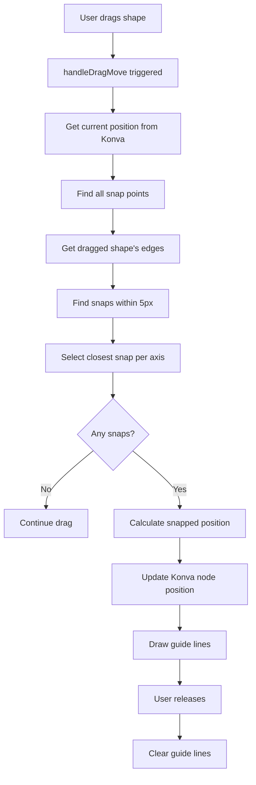

# Snapping Implementation Guide

This document explains how the shape snapping system works in the room planner demo.

## Overview

The snapping system automatically aligns dragged shapes to:

- **Stage boundaries** (edges and center)
- **Other shapes' edges** (start, center, end)

When a shape gets within 5 pixels of a snap point, it automatically aligns and shows blue dashed guide lines.

## Core Components

### 1. Configuration

```typescript
const GUIDELINE_OFFSET = 5; // Snap threshold in pixels
```

This controls how close (in pixels) an edge must be to trigger snapping.

### 2. Data Structures

```typescript
type Rectangle = {
  id: number;
  x: number;        // Anchor point X
  y: number;        // Anchor point Y
  width: number;
  height: number;
  fill: string;
  rotation: number; // In degrees
};

type BoundingBox = {
  x: number;        // Top-left corner after rotation
  y: number;
  width: number;    // Width of axis-aligned bounding box
  height: number;
};

type SnapEdge = {
  guide: number;    // Position of this edge
  offset: number;   // Distance from anchor to edge
  snap: 'start' | 'center' | 'end';
};

type SnapGuide = {
  lineGuide: number;   // Position to draw guide line
  offset: number;      // Offset to apply to anchor point
  orientation: 'V' | 'H';
  snap: string;
};
```

## How It Works

### Step 1: Calculate Bounding Box with Rotation

When a rectangle is rotated, we need its **axis-aligned bounding box** (AABB):

```typescript
function getClientRect(rect: Rectangle): BoundingBox {
  const rad = (rect.rotation * Math.PI) / 180;
  const cos = Math.cos(rad);
  const sin = Math.sin(rad);

  // Calculate all four corners after rotation
  const corners = [
    { x: rect.x, y: rect.y },                                    // Top-left
    { x: rect.x + rect.width * cos, y: rect.y + rect.width * sin },  // Top-right
    {
      x: rect.x + rect.width * cos - rect.height * sin,
      y: rect.y + rect.width * sin + rect.height * cos
    },  // Bottom-right
    { x: rect.x - rect.height * sin, y: rect.y + rect.height * cos }  // Bottom-left
  ];

  // Find min/max to get bounding box
  return {
    x: Math.min(...corners.map(c => c.x)),
    y: Math.min(...corners.map(c => c.y)),
    width: Math.max(...corners.map(c => c.x)) - Math.min(...corners.map(c => c.x)),
    height: Math.max(...corners.map(c => c.y)) - Math.min(...corners.map(c => c.y))
  };
}
```

**Why?** A 45° rotated square has a larger bounding box than the original square dimensions.

### Step 2: Find All Possible Snap Points

```typescript
function getLineGuideStops(skipShapeId, stageWidth, stageHeight) {
  // Stage snap points
  const vertical = [0, stageWidth / 2, stageWidth];
  const horizontal = [0, stageHeight / 2, stageHeight];

  // Add snap points from other shapes
  rectangles.forEach((rect) => {
    if (rect.id === skipShapeId) return; // Skip the shape being dragged

    const box = getClientRect(rect);

    // Add left, center, right edges
    vertical.push(box.x, box.x + box.width / 2, box.x + box.width);

    // Add top, center, bottom edges
    horizontal.push(box.y, box.y + box.height / 2, box.y + box.height);
  });

  return { vertical, horizontal };
}
```

**Result:** Arrays of X and Y coordinates where snapping can occur.

### Step 3: Calculate Dragged Shape's Edges

```typescript
function getObjectSnappingEdges(rect: Rectangle) {
  const box = getClientRect(rect);

  return {
    vertical: [
      {
        guide: box.x,                    // Left edge position
        offset: rect.x - box.x,          // Distance from anchor to left edge
        snap: 'start'
      },
      {
        guide: box.x + box.width / 2,    // Center position
        offset: rect.x - (box.x + box.width / 2),
        snap: 'center'
      },
      {
        guide: box.x + box.width,        // Right edge position
        offset: rect.x - (box.x + box.width),
        snap: 'end'
      }
    ],
    horizontal: [...] // Same pattern for Y axis
  };
}
```

**Why offset?** The anchor point (x, y) may not be at the snapping edge. We need to know the distance to correctly reposition the shape.

### Step 4: Find Snapping Candidates

```typescript
function findAxisSnaps(lineGuides: number[], itemBounds: SnapEdge[]) {
  const snaps = [];

  for (const lineGuide of lineGuides) {      // Each possible snap line
    for (const itemBound of itemBounds) {     // Each edge of dragged shape
      const diff = Math.abs(lineGuide - itemBound.guide);

      if (diff < GUIDELINE_OFFSET) {  // Within 5px?
        snaps.push({ lineGuide, diff, snap: itemBound.snap, offset: itemBound.offset });
      }
    }
  }

  return snaps;
}
```

**Example:**

- Snap line at X=100
- Shape's left edge at X=103
- Difference = 3px (< 5px threshold)
- ✅ Valid snap candidate

### Step 5: Choose Closest Snap Per Axis

```typescript
function getGuides(lineGuideStops, itemBounds): SnapGuide[] {
  const resultV = findAxisSnaps(lineGuideStops.vertical, itemBounds.vertical);
  const resultH = findAxisSnaps(lineGuideStops.horizontal, itemBounds.horizontal);

  const guides = [];

  // Get closest vertical snap
  const minV = resultV.sort((a, b) => a.diff - b.diff)[0];
  if (minV) {
    guides.push({ ...minV, orientation: 'V' });
  }

  // Get closest horizontal snap
  const minH = resultH.sort((a, b) => a.diff - b.diff)[0];
  if (minH) {
    guides.push({ ...minH, orientation: 'H' });
  }

  return guides;
}
```

**Result:** 0-2 guides (one vertical, one horizontal, both, or neither).

### Step 6: Apply Snap Position

```typescript
function calculateSnappedPosition(currentPos, guides) {
  const snappedPos = { ...currentPos };

  for (const guide of guides) {
    if (guide.orientation === 'V') {
      // New X = snap line position + offset to edge
      snappedPos.x = guide.lineGuide + guide.offset;
    } else {
      // New Y = snap line position + offset to edge
      snappedPos.y = guide.lineGuide + guide.offset;
    }
  }

  return snappedPos;
}
```

**Example Math:**

```
Snap line at X=100
Offset = -50 (anchor is 50px right of left edge)
New X = 100 + (-50) = 50
→ Shape's anchor moves to X=50, placing left edge at X=100
```

### Step 7: Draw Guide Lines

```typescript
function createGuideLine(guide: SnapGuide): GuideLine {
  return guide.orientation === 'H'
    ? {
        points: [-6000, 0, 6000, 0],  // Horizontal line across stage
        x: 0,
        y: guide.lineGuide,           // Y position of snap line
        orientation: 'H'
      }
    : {
        points: [0, -6000, 0, 6000],  // Vertical line across stage
        x: guide.lineGuide,           // X position of snap line
        y: 0,
        orientation: 'V'
      };
}
```

**Why 6000?** Creates lines long enough to span any reasonable stage size. Konva clips what's outside the viewport.

## The Drag Flow



## Event Handler

```typescript
function handleDragMove(id: number, stageWidth: number, stageHeight: number) {
  return (e: any) => {
    guideLines = []; // Clear previous guides

    const target = e.target;
    const absPos = target.absolutePosition(); // Get current drag position
    const currentRect = {
      ...rectangles.find(r => r.id === id),
      x: absPos.x,
      y: absPos.y
    };

    // Calculate snapping
    const lineGuideStops = getLineGuideStops(id, stageWidth, stageHeight);
    const itemBounds = getObjectSnappingEdges(currentRect);
    const guides = getGuides(lineGuideStops, itemBounds);

    if (!guides.length) return; // No snap found

    // Apply snap
    guideLines = guides.map(createGuideLine);
    const snappedPos = calculateSnappedPosition(absPos, guides);
    target.absolutePosition(snappedPos); // Update Konva directly
  };
}
```

## Key Design Decisions

### 1. **Direct Konva Manipulation**

```typescript
target.absolutePosition(snappedPos);
```

We update the Konva node directly instead of updating Svelte state. This ensures smooth, real-time snapping during drag operations.

### 2. **Independent Axes**

Horizontal and vertical snapping work independently. A shape can snap:

- Horizontally only
- Vertically only
- Both directions
- Neither direction

### 3. **Closest Wins**

Only the closest snap point per axis is used. This prevents confusion from multiple nearby snap candidates.

### 4. **5px Threshold**

```typescript
const GUIDELINE_OFFSET = 5;
```

Balances helpful snapping with user control. Too large feels "magnetic", too small is hard to trigger.

### 5. **Rotation Support**

The system calculates axis-aligned bounding boxes, so rotated shapes snap using their visual edges, not their internal coordinates.

## Visual Example

```
Stage (800x600)
┌─────────────────────────────────────────┐
│                                         │
│    ┌────┐        ┌────┐                │  Vertical snap lines:
│    │ A  │        │ B  │                │  - 0 (left edge)
│    └────┘        └────┘                │  - 400 (center)
│                                         │  - 800 (right edge)
│         ┌────────┐                      │  - A.x, A.x + A.width/2, A.x + A.width
│         │   C    │ ← Dragging this     │  - B.x, B.x + B.width/2, B.x + B.width
│         └────────┘                      │
│                                         │  When C's edge gets within 5px
└─────────────────────────────────────────┘  of any line → SNAP!
```

## Testing the Implementation

1. **Stage edge snapping**: Drag a shape near the edges
2. **Center snapping**: Drag to the middle of the stage
3. **Shape-to-shape**: Drag one shape near another
4. **Rotation handling**: Rotate a shape, then drag it - bounding box edges snap
5. **Multiple shapes**: Add more shapes and test complex snap scenarios

## Performance Considerations

- **O(n) per drag event**: Iterates through all shapes to find snap points
- **Early returns**: Exits quickly if no snaps found
- **Direct DOM manipulation**: Updates Konva directly instead of re-rendering Svelte
- **Canvas clipping**: Long guide lines don't impact performance (clipped by canvas)

## Future Enhancements

- [ ] Configurable snap threshold
- [ ] Snap to grid
- [ ] Distance indicators on guide lines
- [ ] Multiple simultaneous guide lines
- [ ] Snap to angles (45°, 90°, etc.)
- [ ] Snap preview before releasing
